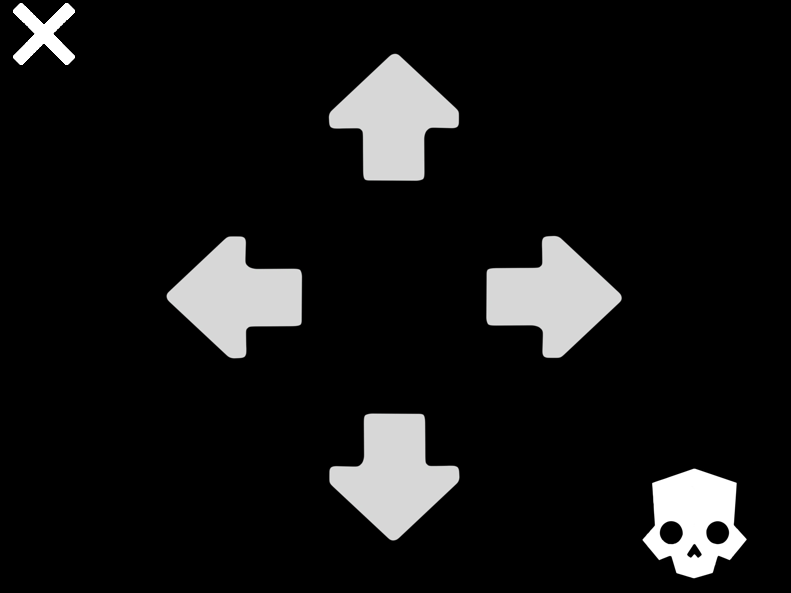
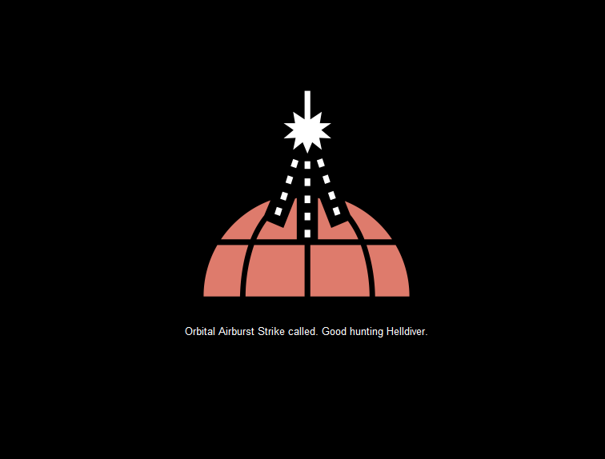

# Description
This project aims to recreate the helldiver wrist computer software. You press the arrow corrsponding to the stratagem you want, and then it shows a picture of the stratagem, alongside its name for a few seconds before clearing. 

This is intended to be used on a raspberry pi touchscreen in order to act as a mini keyboard, and relay the arrow presses from the touchscreen and to your personal computer to create a cool helldiver experience.

Important tidbits to know, the arrows all corespond to inputs, meaning if you press the up arrow **the program will act as a keyboard and press the up arrow.** If you do not want this, just comment out all the lines with keyboard.press(<Key>), they will be under *on_left_click* funciton, and make sure to comment out the keyboard.press(Key.ctrl_l) and keyboard.release(key.ctrl_l) as this will press and hold down the control command.
*The lines which contain keypress comands are: 177, 180, 188, 195, 202 and 209*

If you make a mistake with the stratagem arrow code, the only way to clear it is to press the Skull, which will clear every input, however it may be a good idea to press the skull twice, as one press will hold the control button, and release it. 

The program starts out in a 800x600 resolution window, if you want to full screen it or change the resolution, you can always resize the window, or change the exact resolution on line 304, and if you want to change it to full screen just uncomment line 301. 

# Images

# Requirements
The requirements for this program are:
pillow, pynput, cairosvg. 
The pip command to install all of the imports is:
pip install pillow pynput cairosvg
You will need to install [python](https://www.python.org/downloads/). If you need more assitance this [video](https://www.python.org/downloads/) provides a step by step guide on how to. 

If you get an error "no library called "cairo" | "libcairo-2" | 'libcairo.2.dylib | 2.dll' | Cairo SVG" [then you will need to install the GTK for windows runtime](https://github.com/tschoonj/GTK-for-Windows-Runtime-Environment-Installer/releases)

If you are stuck or confused here is a [video explaning how to install it](https://youtu.be/p2Lws5CyioQ), and solve said issue. 

# Credits
A huge thanks to the [Helldivers-2-Stratagem-Icons-Svg](https://github.com/nvigneux/Helldivers-2-Stratagems-icons-svg) Team for creating all the SVG icons for free and releasing them for public use. 
This project would not have existed without them. 

# Issues 
The arrows may look weird on certain resolutions, the text and image may look stretched out, and the text may overlap the image on certain resolutions. Im sorry, I do not know of a way to fix this, however a 800x600 resolution (which is what the program starts out in) should work fine. If anyone knows a solution on how to fix this issue, please contact me, my profile should have ways to contact, and if you need any extra help you can also contact me and I'll gladly help. Thank you all. 
